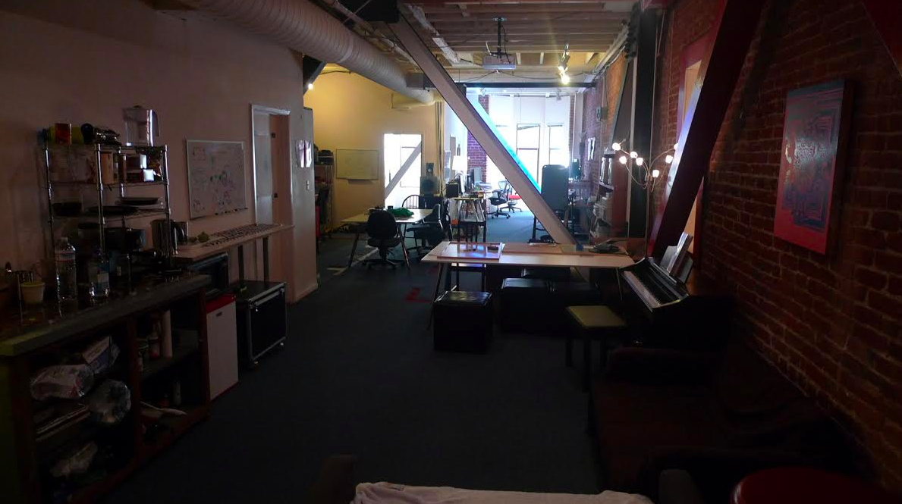

## About

ShinyLab is a shared studio/lab on Market St in San Francisco, CA founded in 2010.

We're interested in creative hardware and software, graphics, creative gaming/media/computing history, computational literacy, education, and sustainable creative studio practice.

Subscribe to our [event calendar](https://calendar.google.com/calendar/embed?src=gip0jbfv4sf08fb1rq14moicnc%40group.calendar.google.com&ctz=America/Los_Angeles).

Current Members

  - Gabriel Dunne (founder)
  - Ryan Alexander (founder)
  - Michael Chang / Minmax LLC (founder)
  - Kristen Neidlinger  
  - Matt Hornyak / Outofhere LLC 
  - Lara Grant
  - Jamie Kosoy // Arbitrary, LLC

Alum

  - Cullen Miller  
  - Eve Weinberg      
  - Sarah Nahm
  - Miguel Hernandez
  - Kai Chang
  - Matt Dryhurst
  - Wesley Smith
  - Olaf Mathe // mixmax.io
  - Jeff Lubow
  - Michal Migurski
  - Ben Cerveny // bloom.io
  - Tom Carden // bloom.io
  - Robert Hodgin // bloom.io
  - Jesper Anderson // bloom.io  
  - Pierre Focult-Conti
  - Michael Porath // visual.ly
  - Ian Johnson // visual.ly
  - Daven Rauchwerk // nextthing.co
  - Josette Melchor // grayarea.org

Questions? Have a workshop or event proposal? Just want say what's up? Contact us:

<form action="https://getsimpleform.com/messages?form_api_token=a06352945bf551c681b6f94e904fa45b" method="post">
  <!-- the redirect_to is optional, the form will redirect to the referrer on submission -->
  <input type='hidden' name='redirect_to' value='http://lab.shiny.ooo/about-submitted.html' />
  <!-- all your input fields here.... -->

  Name <input name='name' type='text' />  
  Email <input name='email' type='text' />  
  Message <textarea name="message" style="width:300px;height:200px;"></textarea> 

  <input type='submit' value='Send' />

     

</form>
